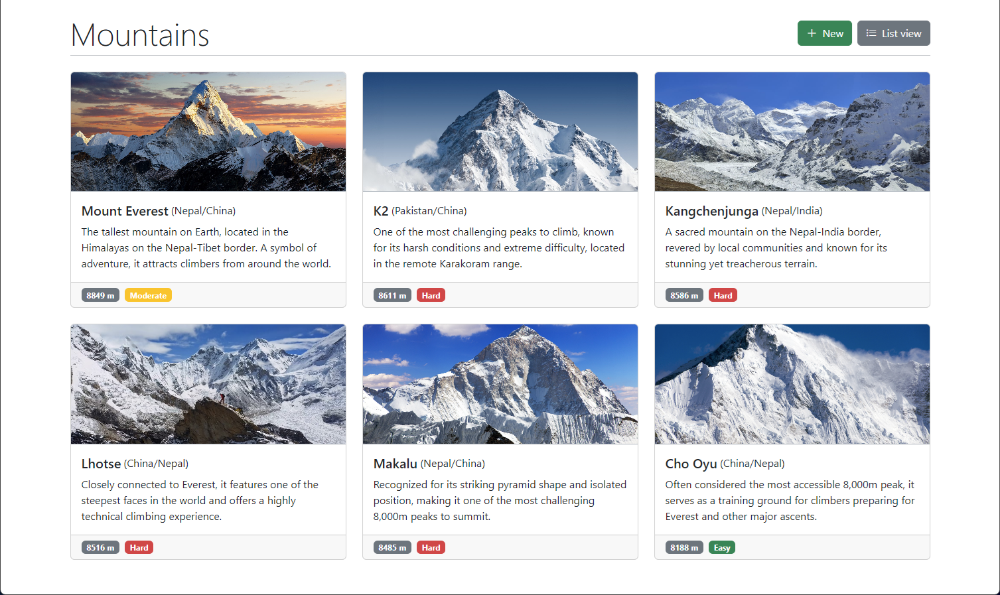

# Mountain App

A React-based web application for tracking and managing mountain peaks.



## Features

### Core Requirements

- **Dual View Listing**
  - Card view (grid layout with images)
  - Compact list view
- **Detailed Mountain View**
  - Unique properties per montain
  - Image display
- **Full CRUD Operations**
  - Create new mountains
  - Edit existing entries
  - Delete with confirmation
- **Clean Routing**
  - RESTful URL structure

### Technical Implementation

- Built with **Preact** + **TypeScript**
- Styled with **Bootstrap 5** & **CSS**
- Responsive design

## Core Routes

| Path                  | Component      | Description                             |
| --------------------- | -------------- | --------------------------------------- |
| `/`                   | `Home`         | Displays all mountains (card/list view) |
| `/mountains/new`      | `NewMountain`  | Form for creating new mountain          |
| `/mountains/:id`      | `Mountain`     | Shows detailed mountain information     |
| `/mountains/:id/edit` | `EditMountain` | Form for editing existing mountain      |

## Data Structure

```typescript
interface Mountain {
  name: string;
  location: string;
  difficulty: "Easy" | "Moderate" | "Hard";
  elevation: number;
  imageUrl: string;
  description: string;
}
```
